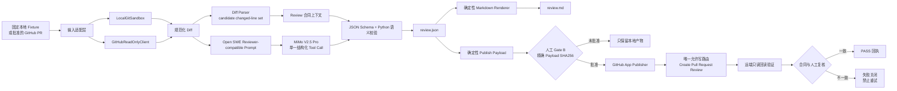
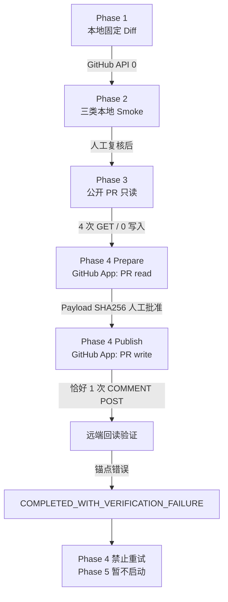

# 项目架构图

## 1. 总体数据流

图中最重要的边界是：模型不能直接调用 GitHub 写接口。模型输出必须先经过 Schema、changed-line 校验、本地产物生成和人工 Payload Hash 批准。

## 2. 权限与阶段演进

## 3. 组件与职责

| 组件 | 主要职责 | 不能证明或不能执行的事情 |
|---|---|---|
| `diff_parser.py` | 从 Unified Diff 计算 Candidate changed lines | 不能判断 Finding 文字是否真的描述该行代码 |
| `contracts.py` | Schema 之后做 changed-line、重复项和决策语义检查 | 不执行代码，不替代人工语义复核 |
| `workflow.py` | 编排 Diff、模型、测试结果与最终 Review | Phase 3/4 只读 PR 模式不执行 PR 测试 |
| `open_swe_adapter.py` | 把 Reviewer-compatible Prompt 与单一结构化 Tool Call 连接起来 | 不是官方完整 Open SWE Pregel graph |
| `github_readonly.py` | 只读 PR metadata/files/diff，验证 Base/Head 快照 | 不包含 GitHub 写接口 |
| `github_app_auth.py` | 生成短期 JWT 和单仓库 installation token | 不保存私钥、JWT 或 token |
| `github_review_publisher.py` | 生成确定性 Payload、限制唯一写路由、回读验证 | 不自动重试，不自动编辑或删除远端 Review |

## 4. 安全边界

- PR 标题、正文和 Diff 都是不可信数据，只进入 user-data 区域。
- MiMo Key、GitHub App 私钥、JWT 和 installation token 不进入 Prompt、产物或 Git。
- Phase 4 的 GitHub App 只安装到项目仓库；唯一仓库内容写操作是一次 `POST /pulls/1/reviews`。
- GitHub event 固定为 `COMMENT`，不会执行 `APPROVE` 或 `REQUEST_CHANGES`。
- Head SHA 漂移、重复 Marker、Payload Hash 不匹配或远端验证失败都会停止。
- Phase 4 已产生错误锚点 Review；该远端负结果保留，不编辑、不删除、不补发。
